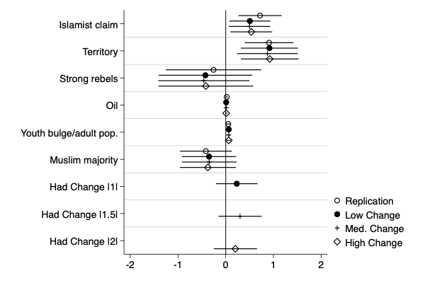

```{r setup, include=FALSE}
knitr::opts_chunk$set(echo = FALSE, warning=FALSE, message=FALSE)
knitr::opts_chunk$set(
  collapse = TRUE,
  comment = ">",
  out.width = "100%"
)
```

## Introduction

This document produces a replication log for the tables and figures made in R for Subject to Change: Quantifying Transformation in Armed Conflict Actors At Scale Using Text. 

The data and analysis are replicated in the accompanying logs. However, as that log produces several hundred pages of logs, I collected the figures and images:

## Manuscript Figure 1

Figure 1. Group-level distributions of one-year topic changes.
It is originally produced by 03analysisFullDataTinyThreshRep.R (and accompanying replication log)


!

## Manuscript Figure 2  and Appendix Figure 12

The code chunk produces manuscript Figure 2 and Appendix Figure 12, which are summaries of the distribution of the new change variables.

```{r repdata, echo=FALSE}

rm(list=ls())

library(tidyverse)
library(haven)
library(dplyr)
library(corrplot)
library(stargazer)

dataPath <- "./data/"

## Read in Nilsson and Svenson's data:
termination <- read_dta(paste0(dataPath,
                               "Termination-data-ISQ.dta"))

changes <- load("./02dfyearsumAndRelatedTinyUpdate.Rdata")

idkey <- read_csv(paste0(dataPath,"translate_actor.csv"))

## Add the new/old ID key:
t.groups.after1989 <- unique(termination[which(
    termination$year>=1989),]$sidebid)

c.groups <- unique(df.yearsum$groupID)

## Match group IDs:. 
## Nilsson and Svensson based their work on:
## UCDP Conflict Termination Dataset version 2–2015, which is before
## UCDP changed the id numbering scheme.

termination$sidebid <- as.numeric(termination$sidebid)
ids.termination <- unique(termination$sidebid)

termination <- merge(termination,
                     idkey,
                     by.x=("sidebid"),
                     by.y=("old_id"),
                     all.x=TRUE)

ids.yearsum <- unique(df.yearsum$groupID)
terminationplus1 <- merge(x=termination,
                         y=df.yearsum,
                         by.x=c("new_id", "year"),
                         by.y=c("groupID", "year"),
                         all.x=TRUE)

## Terminationplus1 is more or less their original data
## limit to 1989 and later

terminationplus <- terminationplus1[which(
    terminationplus1$year>=1989),]

## Identify the armed groups that had a change of
## 1, 1.5 and greater than 2:

haddelta1 <- unique(terminationplus[which(
    terminationplus$delta1==1),]$new_id)

haddelta1.5 <- unique(terminationplus[which(
    terminationplus$delta1.5==1),]$new_id)

haddelta2 <- unique(terminationplus[which(
    terminationplus$delta2==1),]$new_id)

## Add in the indicator variable for whether
## the militant group in a dyad had a change
## In any year:

terminationplus$haddelta1 <- 0
terminationplus$haddelta1 <- ifelse(terminationplus$new_id
                                    %in% haddelta1, 1, 0)

terminationplus$haddelta1.5 <- 0
terminationplus$haddelta1.5 <- ifelse(terminationplus$new_id
                                    %in% haddelta1.5, 1, 0)
terminationplus$haddelta2 <- 0
terminationplus$haddelta2 <- ifelse(terminationplus$new_id
                                    %in% haddelta2, 1, 0)

numchanges<- terminationplus %>%
    group_by(new_id) %>%
    summarise(numchanges=sum(delta1==1))

## merge back in:
terminationplus <- terminationplus %>%
    left_join(numchanges,
              by="new_id") 

##%%%%%%%%%%%%%%%%%
## Summary statistics
## For change and also for the introduced variables
##%%%%%%%%%%%%%%%%%%
## number of changes
## Count variable

## format a small DF to report summary statistics:
## for the binary variables:

binaries <- c("Change year",
              "Change in Prev. 2 years",
              "Had 'Low' Change",
              "Had 'Med.' Change",
              "Had 'High' Change")

df <- as.data.frame(cbind(binaries,
                          rbind(table(terminationplus$delta1),
                                table(terminationplus$delta1_L2),
                                table(terminationplus$haddelta1),
                                table(terminationplus$haddelta1.5),
                                table(terminationplus$haddelta2))))

#print(table(terminationplus$delta1))
#table(terminationplus$delta1_L2)


## Article Figure 2:
colnames(df) <- c("Variable", "No", "Yes")
stargazer(df[3:5,], summary=FALSE, rownames=FALSE)


sum.df <- terminationplus[,c("numchanges","counter")]

## Appendix Figure 12:
stargazer(sum.df,
          covariate.labels =c("Number of Changes",
              "Years Since Change"
              ))

```

## Manuscript Figure 3:

These images are produced in the STC_STATA_Replication.do script:

{width=50%}

## Appendix Figure 1

This is a ridge plot of the lengths of articles. 
It is originally produced by 03analysisFullDataTinyThreshRep.R (and accompanying replication log)


## Appendix Figures 2-5, 10

The following code replicates the group-year summary plots. 
These are Appendix Figures 2 (AQAP), 3 (Abu Sayyaf), 4 (ULFA), 5 (LRA), and Appendix Figure 10a (PKK)
The originals are produced in annotedAQAPGraph.R and 

{width=75%}

{width=75%}

{width=75%}

{width=75%}


## Appendix Figures 6 and 7
The plots are  Appendix Figures 6 and 7, which evaluate the effect of media access on estimated change points.

These snippets address whether the approach is more likely to find changes in difficult reporting environments, which would suggest that what is being modeled is something other than behavioral changes.

They are produced by 03ClocationPrecisionRep.R

Appendix Figure 6 (L) and Figure 7(R)

{width=45%}
{width=45%}

## Appendix Figure 8

Effect of minimum document requirements on regression output.
These plots are produced by STATA and saved into the ./images/ directory. They are collected here for convenience:

Top row:

{width=30%}
{width=30%}
{width=30%}

Middle row:

{width=30%}
{width=30%}
{width=30%}

Bottom row:

{width=30%}
{width=30%}
{width=30%}

## Appendix Section 5: Topic Model Specifications

The analysis for Appendix Section 5: Topic Model Specifications are captured here. They are produced by 
 implementAltPKKAQAP.R (Appendix Table 1, Appendix Figure 9, Appendix Figure 10 (right)).
 
Appendix Table 1 is accessible in the log for implementAltPKKAQAP.html. It is the last table in the .html.
 
The plots are included below for convenience, from the files produced in the repository:

Appendix Figure 9:

ONLF Alternate Specifications

{width=45%}
{width=45%}

LRA Alternate Specifications

{width=45%}
{width=45%}

Appendix Figure 10

PKK Alternate specifications

The first plots is produced in analysisGroupPlotsRep.R, the second by implementAltPKKAQAP.R

{width=30%}
{width=30%}


## Appendix Figure 11

Produced by 04nsPrepTerminationRep.R


## Appendix Figure 12

This table was produced above in the first chunk, with the Latex code reproduced on page 2 of the pdf.

## Appendix Figure 13: 

The following compiles the figures produced by the STATA .do files:

Termination model with additional time covariates:

{width=60%}

## Appendix Figure 14 

{width=60%}

